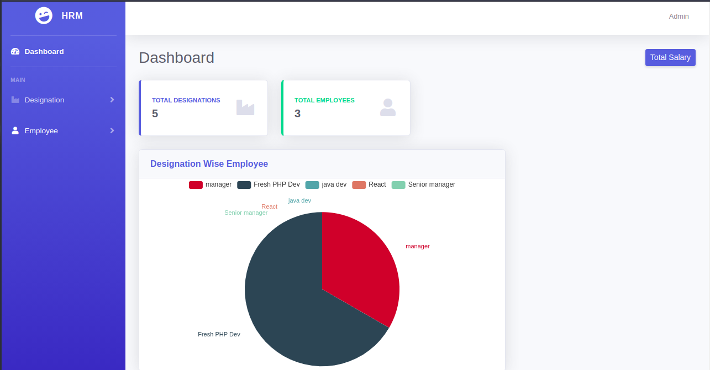

## About GIL HRM Task

## How to Run

-1 composer install  
-2 cp .env.example .env  
-3 php artisan key:generate  
-4 Create an empty database  
-5 In the .env file fill in the DB_HOST, DB_PORT, DB_DATABASE, DB_USERNAME, and DB_PASSWORD  
-6 php artisan migrate  
-7 php artisan db:seed --class=AdminUserSeeder  
-8 php artisan serve  
-9 login with [email == admin@gmail.com, password == 12345678]  

## License

The Laravel framework is open-sourced software licensed under the [MIT license](https://opensource.org/licenses/MIT).
