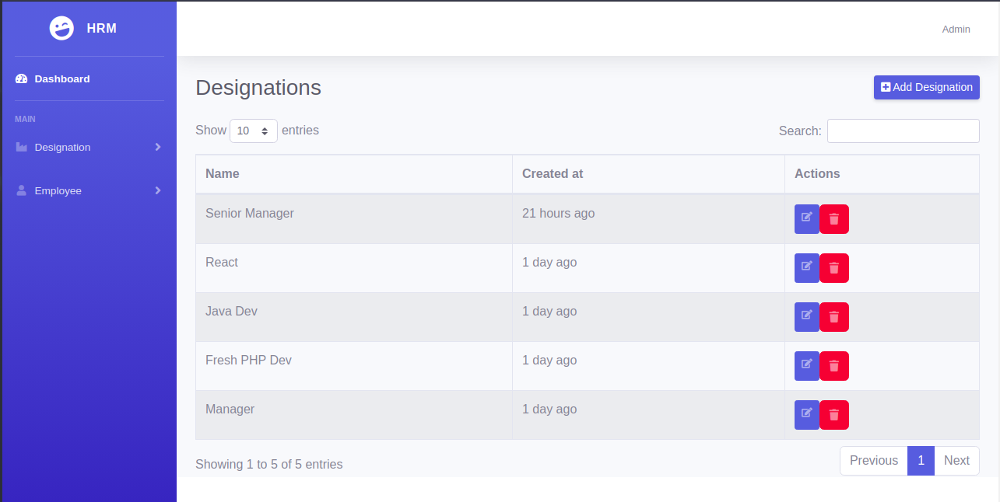

## About GIL HRM Task  
Build with Laravel

1- Login for admin

2- Main Dashboard with All the statistics being implemented 

3- Bootstrap Modal showing Total Salary

4- Designation Entry form

5- Showing List of Designations

6- Employee Entry form

7- List of employees

8- Details view of employees

9- Entry form for adding employee information

## How to Run

-1) composer install  
-2) cp .env.example .env  
-3) php artisan key:generate  
-4) Create an empty database  
-5) In the .env file fill in the DB_HOST, DB_PORT, DB_DATABASE, DB_USERNAME, and DB_PASSWORD  
-6) php artisan migrate  
-7) php artisan db:seed --class=AdminUserSeeder  
-8) php artisan serve  
-9) login with [email == admin@gmail.com, password == 12345678]  

## License

The Laravel framework is open-sourced software licensed under the [MIT license](https://opensource.org/licenses/MIT).
